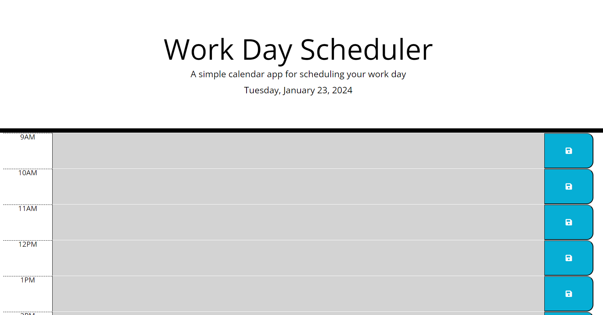

# Third_Party-APIs-Work-Day-Scheduler
# Work Day Scheduler

A simple calendar application for scheduling your work day.

## Table of Contents
- [Description](#description)
- [Features](#features)
- [Getting Started](#getting-started)
  - [Prerequisites](#prerequisites)
  - [Installation](#installation)
- [Usage](#usage)
- [Contributing](#contributing)
- [License](#license)
- [Acknowledgments](#acknowledgments)

## Description

This project is a web-based Work Day Scheduler that allows users to manage their daily tasks effectively. Users can add important events for each hour of the day and save them locally, ensuring persistence between page refreshes.

## Features

- Display the current day at the top of the calendar.
- Present time blocks for standard business hours with color-coding based on past, present, and future.
- Allow users to enter events for each time block.
- Save events in local storage when the save button is clicked.
- Persist events between page refreshes.

## Getting Started

### Prerequisites

Before running the project, make sure you have the following installed:

- Web browser (Google Chrome, Mozilla Firefox, etc.)

### Installation

1. Clone the repository:

   ```bash
   git clone [repository_url]

### Usage

Open the Work Day Scheduler in your web browser.
The current day is displayed at the top of the calendar.
Time blocks for standard business hours are presented with color-coding based on past, present, and future.
Click on a time block to enter an event for that hour.
Click the save button to store the event in local storage.
Refresh the page to see persisted events.

